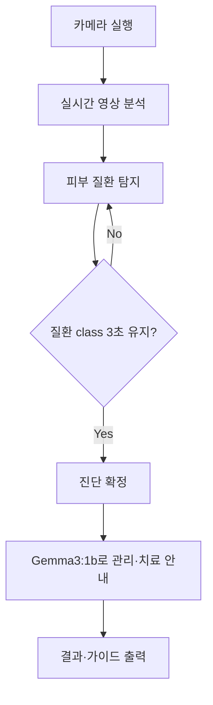

# AI 기반 피부병 진단 시스템

> **📅 작성일**: 2025-07-06  
> **👥 팀**: 11조 ‑ *엄찬하, 임재홍, 김민규, 신상학*  
> **🏫 과정**: 서울상공회의소 ‑ AI 시스템 반도체 설계 2기

---

## 📋 개요

본 프로젝트는 **카메라 기반**으로 사용자의 피부 상태를 인식하고, **딥러닝 모델**을 통해 피부 질환을 자동 진단하는 **인공지능 스킨케어 시스템**을 구축하는 것을 목표로 합니다.

- 실시간 카메라 영상 분석 ➡️ 피부 병변 탐지 및 분류(MNv2 모델)
- **질환 class가 일정 시간 동안 유지**될 때만 진단 확정 → 잘못된 판단 최소화
- 진단 결과에 따라 **Gemma3 : 1b LLM** 으로 관리·치료 가이드 제공
- 향후 **스마트 키오스크·모바일 앱** 등 다양한 형태로 확장 가능

---

## 🎯 목표

1. **실시간 AI 진단 시스템** 구축 (카메라 + MNv2)
2. **클래스 유지 시간 기반** 신뢰도 향상 로직 적용
3. **질환별 관리·치료 팁** 자동 안내 (Gemma3 : 1b)

---

## 💡 기대 효과

- **조기 발견**으로 피부 질환 악화 방지
- **병원 방문 전 자가 진단**·관리 가능
- 정확한 분류로 **불필요한 제품 소비 절감** 및 효율적 피부 관리

---

## 📊 기획 배경 & 시장 조사

- 피부질환은 **전 국민 3명 중 1명**이 경험
- 바쁜 현대인은 민간요법·검색 의존 → **오진·악화 위험** 증가
- 기존 AI 피부 솔루션은 **전문 장비 또는 고해상도 이미지** 필요 → 접근성 낮음
- 필요 조건: **저사양 카메라 + 경량 모델**로 누구나 사용 가능한 서비스

---

## 🔧 시스템 구성 & 주요 기능

### 진단 프로세스

| 단계 | 세부 내용 |
|------|-----------|
| 1️⃣ 카메라 실행 | 사용자는 피부를 카메라 중앙에 위치 |
| 2️⃣ 탐지·분류 | MNv2 모델로 프레임마다 질환 class 예측 |
| 3️⃣ 신뢰도 검증 | 동일 class **3 초** 유지 시 진단 확정 |
| 4️⃣ LLM 안내 | Gemma3 : 1b가 **5단계 관리·치료 가이드** 제공 |
| 5️⃣ 결과 출력 | 질환명·설명·관리법·병원 권장 여부 표시 |

---

## 🧠 학습 데이터 & 모델 구조

### 데이터셋
- **AI Hub – 피부별 종양** 이미지

### 모델
- **분류기**: CNN (MobileNetV2 전이학습)  
- **LLM**: Gemma3 : 1b (질환 설명·관리 가이드 생성)

### 평가 지표
- **Accuracy** (정확도)

### 경량화 & 최적화
- 모델을 **ONNX** 변환 → ONNX Runtime 최적화 (mem-pattern 등)  
- Edge·모바일 기기에서도 **실시간 추론** 가능  
- 메모리·연산량 ↓, 정확도 유지 → **빠르고 신뢰성 높은 진단**

---

## 🛠️ 사용 기술 & 개발 환경

| 구분 | 기술 |
|------|------|
| **언어** | Python |
| **프레임워크** | TensorFlow · OpenCV · TensorFlow Lite · ONNX Runtime |
| **모델** | Gemma3 : 1b · MobileNetV2 |
| **인터페이스** | 웹 · 키오스크 · 모바일 앱 (확장 예정) |

---

## 🚀 향후 계획

- 🏥 **병원 연계**: 전자의무기록(EMR) 시스템과 연동
- 💊 **약국 키오스크**: 즉석 진단 + OTC 제품 추천
- 📱 **모바일 앱**: 개인 맞춤형 피부 관리 플래너
- 🏠 **홈케어 IoT**: 스마트 거울·조명 연계
- 🔬 **추가 질환 확대**: 분류 class 7 → 20+ 단계적 확장

---

> **ⓒ 2025 Team 11.** 본 문서는 프로젝트 이해를 돕기 위한 요약본입니다. 상업적 이용·배포 시 사전 허가가 필요합니다. 
